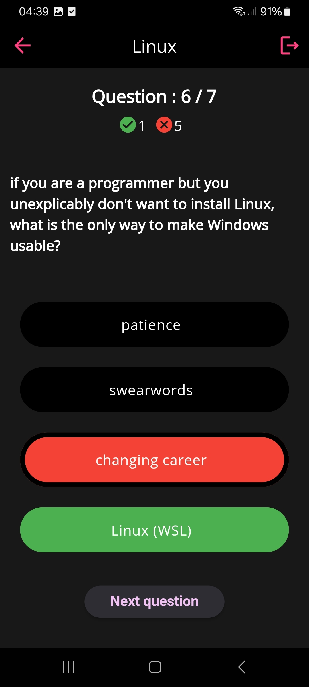

# Quizme
Group project for the course "Programming Mobile Apps in Flutter - TIG333" (GU). 

**Quizme** is an app where you can create quizzes and play them. Firebase is used as the database. The app was written in Flutter.

Due to limited development time, the app was left mostly unfinished. See [**Future Work**](#future-work) for the planned MVP product. See [**Gallery**](#gallery) for current progress.

## Functionalities
- Register account. **Broken login**.
- Create / delete / edit quiz.
- Play quiz.

## Future Work

- **Styling Improvements**: Enhance the app's styling for a consistent color scheme.
- **Authentication Redesign**: Revamp the authentication and login process to function properly and avoid storing passwords as plaintext in the database. Consider using **Firebase Authentication**.
- **UI Enhancements**: Redesign the quiz edit and delete buttons for better usability.
- **Confirmation Prompts**: Implement a confirmation prompt when users attempt to delete a quiz.
- **User-Specific Quizzes**: Allow each user to manage their own quizzes.
- **Quiz Categories**: Introduce categories for quizzes to make them more organized.
- **Quiz Sharing**: Enable quiz sharing functionality.
- **Home Feed**: Create a home feed showcasing public quizzes created by users, with the option to mark quizzes as private or public.
- **Dark Mode**: Implement a dark mode option for better accessibility and user comfort.
- **Search and Filter**: Add functionality to search and filter quizzes by categories or difficulty level.

## Gallery

|  |  |
|-----------------------------|------------------------------|
| *Login*             | *My quizzes feed*       |

|    |  |
|-----------------------------|------------------------------|
| *Quiz play*          | *Quiz result*   |

|     |  |
|-----------------------------|------------------------------|
| *Add/Edit quiz*          | *Add/Edit question*            |